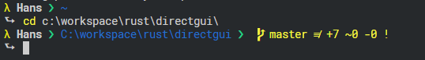

# Ham oh-my-posh theme 🎨⚡
> *I have the POWER!* - HeMan

## Preview


## Requirements
- [oh-my-posh](https://github.com/JanDeDobbeleer/oh-my-posh)
- [powerline-fonts](https://github.com/powerline/fonts)

If you need help setting up everything follow this [guide](https://gist.github.com/jchandra74/5b0c94385175c7a8d1cb39bc5157365e)

## Install

- Execute the following download script

```ps
(New-Object System.Net.WebClient).DownloadFile("https://raw.githubusercontent.com/Hammster/ham-theme/master/ham.psm1", "$(Join-Path -path $ThemeSettings.MyThemesLocation . -Resolve)\ham.psm1")
```

- Set the theme in your `$profile` via `Set-Theme Ham`
- If Powershell is allready running reload your profile `& $profile`